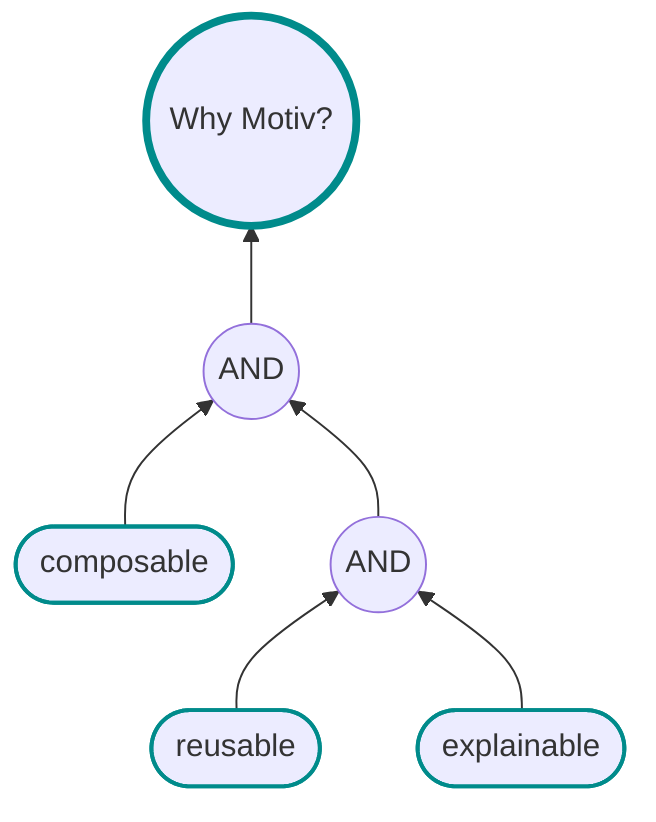
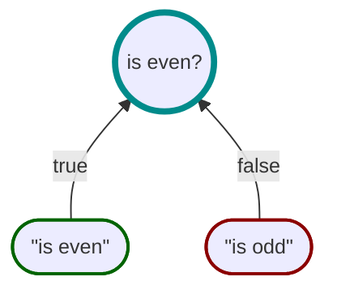
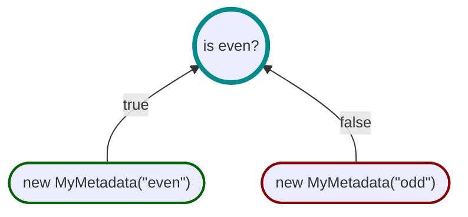
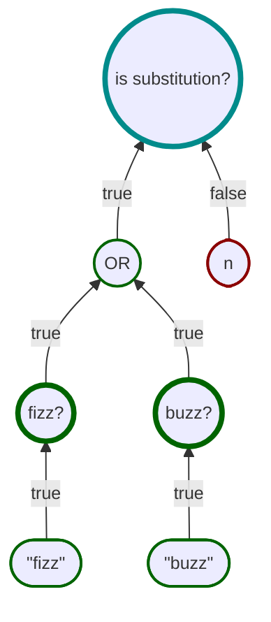

# Motiv

<div style="display: flex; justify-content: center;">


```mermaid
flowchart BT

    A --> P(("&nbsp;Why Motiv?&nbsp;"))
    B(["composable"]) --> A((AND))
    C((AND)) --> A
    D(["reusable"]) --> C
    E(["explainable"]) --> C

    style E stroke:darkcyan,stroke-width:2px
    style D stroke:darkcyan,stroke-width:2px
    style B stroke:darkcyan,stroke-width:2px
    style P stroke:darkcyan,stroke-width:4px
```

</div>

### Know _Why_, not just _What_

---

Motiv offers a pragmatic solution to the _[Boolean Blindness](https://existentialtype.wordpress.com/2011/03/15/boolean-blindness/)_ problem—the loss of context when logic is evaluated to a single true or false value. It achieves this by decomposing logical expressions into individual atomic [propositions](https://en.wikipedia.org/wiki/Proposition). This preserves the specific causes of a decision during evaluation, allowing them to be utilized later. In most cases, this means providing a human-readable explanation of the decision, but it can also be used to surface underlying state.

To see Motiv in action:


```csharp
// Define a proposition using an expression tree
var isInRangeAndEven = Spec.From((int n) => n >= 1 & n <= 10 & n % 2 == 0)
                           .Create("in range and even");

// Evaluate proposition (typically elsewhere in your code)
var result = isInRangeAndEven.Evaluate(11);

result.Satisfied;  // false
result.Assertions; // ["n > 10", "n % 2 != 0"]
result.Reason;     // "¬in range and even"
```


## Installation

Motiv is available as a [NuGet Package](https://www.nuget.org/packages/Motiv/).
Install it using one of the following methods:

**NuGet Package Manager Console:**
```bash
Install-Package Motiv
```

**.NET CLI:**
```bash
dotnet add package Motiv
```

## Usage

There are two primary ways to create propositions in Motiv:

1.  **[`Spec.Build()`](docs/builder/Build.md)**: For creating individual, atomic propositions using a predicate function.
2.  **[`Spec.From()`](docs/builder/From.md)**: For transforming a lambda expression tree into multiple, interconnected atomic propositions.

### Build()

The `Spec.Build()` method is fundamental for creating propositions. It accepts a lambda function that returns a `bool`, a `BooleanResult<TMetadata>`, or a `PolicyResult<TMetadata>`. It can also take another proposition or a composition of propositions as its argument.


```csharp
Spec.Build((int n) => n % 2 == 0)
    .Create("is even");
```

### From()

The `Spec.From()` method creates a proposition from a lambda expression tree (`Expression<Func<TModel, bool>>`). This is often the simplest way to start with Motiv, as it automatically breaks down a single lambda expression into multiple propositions. Each sub-expression is evaluated individually and its result is expressed as an assertion in code form. This is particularly useful for debugging and understanding complex logic. These auto-generated assertions can be overridden with custom ones if needed, while still retaining the original expression for reference.

```csharp
Spec.From((int n) => n >= 1 & n <= 10 & n % 2 == 0)
    .Create("in range and even");
```

## Advanced Proposition Features

### Explicit Assertions

For more descriptive results, use `WhenTrue()` and `WhenFalse()` to define custom assertions.
Continuing with the previous example, let's provide more explicit feedback when the number is odd:



```mermaid
%%{init: { 'themeVariables': { 'fontSize': '13px' }}}%%
flowchart BT

    True(["&quot;is even&quot;"]) -->|true| P(("is even?"))
    False(["&quot;is odd&quot;"]) -->|false| P

    style P stroke:darkcyan,stroke-width:4px
    style True stroke:darkgreen,stroke-width:2px
    style False stroke:darkred,stroke-width:2px
```


```csharp
var isEven =
    Spec.Build((int n) => n % 2 == 0)
        .WhenTrue("is even")
        .WhenFalse("is odd")
        .Create();

var result = isEven.Evaluate(3);

result.Satisfied;  // false
result.Reason;     // "is odd"
result.Assertions; // ["is odd"]
```

### Custom Metadata

For scenarios requiring more context, you can use metadata instead of simple string assertions.
For example, let's instead attach _metadata_ to our example:



```mermaid
%%{init: { 'themeVariables': { 'fontSize': '13px' }}}%%
flowchart BT

    True(["new MyMetadata&lpar;&quot;even&quot;&rpar;"]) -->|true| P(("is even?"))
    False(["new MyMetadata&lpar;&quot;odd&quot;&rpar;"]) -->|false| P

    style P stroke:darkcyan,stroke-width:4px
    style True stroke:darkgreen,stroke-width:2px
    style False stroke:darkred,stroke-width:2px
```


```csharp
var isEven =
    Spec.Build((int n) => n % 2 == 0)
        .WhenTrue(new MyMetadata("even"))
        .WhenFalse(new MyMetadata("odd"))
        .Create("is even");

var result = isEven.Evaluate(2);

result.Satisfied;  // true
result.Reason;     // "is even"
result.Assertions; // ["is even"]
result.Value;      // { Text: "even" }
```

### Composing Propositions

Motiv's true power shines when composing logic from simpler propositions, and then using their results to create new
assertions.
To demonstrate this,
we are going to solve the classic [Fizz Buzz](https://en.wikipedia.org/wiki/Fizz_buzz) problem using Motiv.
In this problem, we need to determine if a number is divisible by 3, 5, or both,
and then provide the appropriate feedback for each case.

Below is the flowchart of our solution:



```mermaid
%%{init: { 'themeVariables': { 'fontSize': '13px' }}}%%
flowchart BT
    TrueOr((OR)) -->|true| P(("is substitution?"))
    False(["n"]) -->|false| P
    TrueIsFizz(("fizz?")) -->|true| TrueOr
    TrueIsBuzz(("buzz?")) -->|true| TrueOr
    TrueIsFizzTrue(["&quot;fizz&quot;"]) -->|true| TrueIsFizz
    TrueIsBuzzTrue(["&quot;buzz&quot;"]) -->|true| TrueIsBuzz


    style P stroke:darkcyan,stroke-width:4px
    style TrueOr stroke:darkgreen,stroke-width:2px
    style TrueIsFizz stroke:darkgreen,stroke-width:4px
    style TrueIsBuzz stroke:darkgreen,stroke-width:4px
    style TrueIsFizzTrue stroke:darkgreen,stroke-width:2px
    style TrueIsBuzzTrue stroke:darkgreen,stroke-width:2px

    style False stroke:darkred,stroke-width:2px
```

This is then implemented in code as follows:

<!--
<iframe width="100%" height="475" src="https://dotnetfiddle.net/Widget/uYefQ8" frameborder="0"></iframe>
-->
See the live example on [.NET Fiddle](https://dotnetfiddle.net/uYefQ8).

This example demonstrates how you can compose complex propositions from simpler ones using Motiv.

### Custom Types and Reuse

Motiv provides base classes to create your own strongly-typed propositions, promoting reusability across your codebase.

For example, let's create a strongly-typed proposition to determine if a number is even:

```csharp
public class IsEven() : Spec<int>(
    Spec.Build((int n) => n % 2 == 0)
        .WhenTrue("is even")
        .WhenFalse("is odd")
        .Create());
```

This `IsEven` class can then be instantiated and used directly. Strongly typing also helps avoid ambiguity when registering with a Dependency Injection (DI) container.

---

## When to Use Motiv

Motiv is not intended to replace all boolean logic in your application. It should be used selectively where its benefits are most apparent. If your logic is straightforward or doesn't require detailed feedback on decisions, Motiv might not offer a significant advantage. It's another tool in your development toolkit; sometimes, the simplest solution is the most effective.

Consider using Motiv when you need two or more of the following capabilities:

1. **Visibility**: Granular, real-time feedback about decisions
2. **Decomposition**: Break down complex logic into meaningful subclauses
3. **Reusability**: Avoid logic duplication across your codebase
4. **Modeling**: Explicitly model your domain logic (e.g., for
   [Domain-Driven Design](https://en.wikipedia.org/wiki/Domain-driven_design))
5. **Testing**: Test your logic in isolation—without mocking dependencies

### Tradeoffs

1. **Performance**: Motiv is not designed for high-performance scenarios where every nanosecond counts.
   Its focus is on maintainability and readability, although in most use-cases the performance overhead is negligible.
2. **Dependency**: Once embedded in your codebase, removing Motiv can be challenging.
   However, it does not depend on any third-party libraries itself, so it won't bring any unexpected baggage.
3. **Learning Curve**: New users may need time to adapt to Motiv's approach and API
