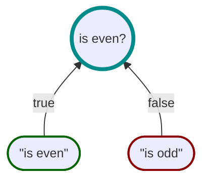

# Motiv

<div style="display: flex; justify-content: center;">


</div>

### Know _Why_, not just _What_

---

Motiv is a developer-first .NET library that transforms the way you work with boolean logic.
It lets you form expressions from discrete [propositions](https://en.wikipedia.org/wiki/Proposition) so that you
can explain _why_ decisions were made.

To demonstrate Motiv in action,
let's create some [atomic propositions](https://en.wikipedia.org/wiki/Atomic_sentence):

```csharp
// Define propositions
var isValid = Spec.Build((int n) => n is >= 0 and <= 11).Create("valid");
var isEmpty = Spec.Build((int n) => n == 0).Create("empty");
var isFull  = Spec.Build((int n) => n == 11).Create("full");
```

Then compose using boolean operators:

```csharp
// Compose a new proposition
var isPartiallyFull = isValid & !(isEmpty | isFull);
```

And evaluate to get detailed feedback:

```csharp
// Evaluate the proposition
var result = isPartiallyFull.IsSatisfiedBy(5);

result.Satisfied;   // true
result.Assertions;  // ["valid", "¬empty", "¬full"]
result.Reason;      // "valid & !(¬empty | ¬full)"
```

Assertions will bubble up the root of the proposition tree (if they contributed to the final results).
This can be seen in the following flowchart:


## Installation

Motiv is available as a [NuGet Package](https://www.nuget.org/packages/Motiv/).
Install it using one of the following methods:

**NuGet Package Manager Console:**
```bash
Install-Package Motiv
```

**.NET CLI:**
```bash
dotnet add package Motiv
```

## Basic Usage


Let's start with an example of a minimal/atomic proposition to demonstrate Motiv's core concepts.  Take the example of
determining if a number is even:


```csharp
// Define a atomic proposition
var isEven = Spec.Build((int n) => n % 2 == 0).Create("is even");

// Evaluate the proposition
var result = isEven.IsSatisfiedBy(2);

result.Satisfied;   // true
result.Reason;      // "is even"
result.Assertions;  // ["is even"]
```

This minimal example showcases how easily you can create and evaluate propositions with Motiv.

## Advanced Usage

### Explicit Assertions

For more descriptive results, use `WhenTrue()` and `WhenFalse()` to define custom assertions.
Continuing with the previous example, let's provide more explicit feedback when the number is odd:





```csharp
var isEven =
    Spec.Build((int n) => n % 2 == 0)
        .WhenTrue("is even")
        .WhenFalse("is odd")
        .Create();

var result = isEven.IsSatisfiedBy(3);

result.Satisfied;  // false
result.Reason;     // "is odd"
result.Assertions; // ["is odd"]
```

### Custom Metadata

For scenarios requiring more context, you can use metadata instead of simple string assertions.
For example, let's instead attach _metadata_ to our example:


```csharp
var isEven =
    Spec.Build((int n) => n % 2 == 0)
        .WhenTrue(new MyMetadata("even"))
        .WhenFalse(new MyMetadata("odd"))
        .Create("is even");

var result = isEven.IsSatisfiedBy(2);

result.Satisfied;  // true
result.Reason;     // "is even"
result.Assertions; // ["is even"]
result.Value;      // { Text: "even" }
```

### Composing Propositions

Motiv's true power shines when composing logic from simpler propositions, and then using their results to create new
assertions.
To demonstrate this,
we are going to solve the classic [Fizz Buzz](https://en.wikipedia.org/wiki/Fizz_buzz) problem using Motiv.
In this problem, we need to determine if a number is divisible by 3, 5, or both,
and then provide the appropriate feedback for each case.

Below is the flowchart of our solution:


This is then implemented in code as follows:

<iframe width="100%" height="475" src="https://dotnetfiddle.net/Widget/uYefQ8" frameborder="0"></iframe>

This example demonstrates how you can compose complex propositions from simpler ones using Motiv.

### Custom Types and Reuse

Motiv provides some classes to inherit from so that you can create your own strongly typed propositions which
can be reused across your codebase.

For example, let's create a strongly typed proposition to determine if a number is even:

```csharp
public class IsEven() : Spec<int>(
    Spec.Build((int n) => n % 2 == 0)
        .WhenTrue("is even")
        .WhenFalse("is odd")
        .Create();
```
This can then be instantiated where needed and used as-is.
Also, by making it strongly typed, you can ensure that there is no ambiguity when registering it with a DI container.

---

## When to Use Motiv

Motiv is not meant to replace all your boolean logic.
You should only use it when it makes sense to do so.
If your logic is pretty straightforward or does not really need any feedback about the decisions being made, then
you might not see a big benefit from using Motiv.
It is just another tool in your toolbox, and sometimes the simplest solution is the best fit.

Consider using Motiv when you need two or more of the following:

1. **Visibility**: Granular, real-time feedback about decisions
2. **Decomposition**: Break down complex logic into meaningful subclauses
3. **Reusability**: Avoid logic duplication across your codebase
4. **Modeling**: Explicitly model your domain logic (e.g., for
   [Domain-Driven Design](https://en.wikipedia.org/wiki/Domain-driven_design))
5. **Testing**: Test your logic in isolation—without mocking dependencies

### Tradeoffs

1. **Performance**: Motiv is not designed for high-performance scenarios where every nanosecond counts.
   Its focus is on maintainability and readability, although in most use-cases the performance overhead is negligible.
2. **Dependency**: Once embedded in your codebase, removing Motiv can be challenging.
   However, it does not depend on any third-party libraries itself, so it won't bring any unexpected baggage.
3. **Learning Curve**: New users may need time to adapt to Motiv's approach and API
