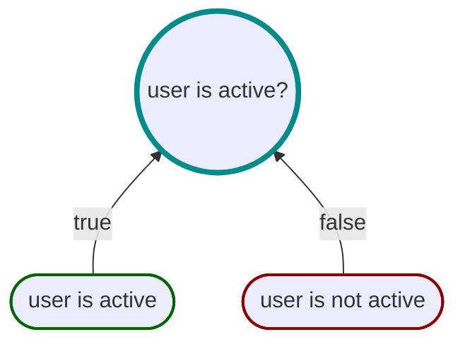

# Explanation Propositions

_Explanation propositions_ are used to provide human-readable feedback to users (or developers).

While all propositions will populate the `Assertions` property with useful information, _explanation propositions_
populate `Assertions` with the strings obtained from their `WhenTrue()`, `WhenTrueYield()`, `WhenFalse()`, and
`WhenFalseYield()` methods.

For example, consider the following proposition:



```csharp
var isUserActive =
    Spec.Build((User user) => user.IsActive)
        .WhenTrue("user is active")
        .WhenFalse("user is not active")
        .Create();

isUserActive.Statement;  // "user is active"
isUserActive.Expression; // "user is active"

isUserActive.IsSatisfiedBy(activeUser).Reason;      // "user is active"
isUserActive.IsSatisfiedBy(activeUser).Assertion;   // ["user is active"]

isUserActive.IsSatisfiedBy(inactiveUser).Reason;    // "user is not active"
isUserActive.IsSatisfiedBy(inactiveUser).Assertion; // ["user is not active"]

```

