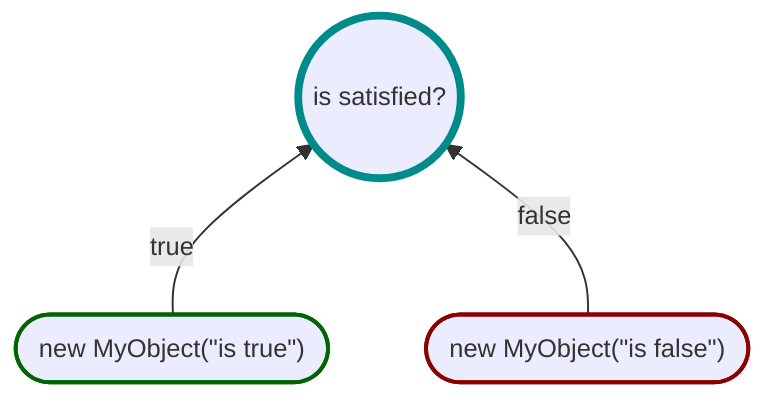

# Metadata Propositions




Metadata propositions allow custom POCO types, known as _metadata_, to be attached to the result.
Much the same as [explanation propositions](ExplanationProposition.md), metadata propositions can be used to
provide feedback to the user, but instead using custom types to describe the state instead of strings.

```csharp
Spec.Build(User user => user.IsAdmin)
    .WhenTrue(user => new Message
        {
            English = "user is an admin",
            French = "l'utilisateur est un administrateur"
        })
    .WhenFalse(user => new Message
        {
            English = "user is not an admin",
            French = "l'utilisateur n'est pas un administrateur"
        })
    .Create("is user an admin");
```
