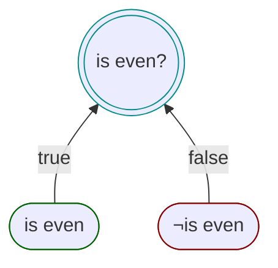

# Minimal (atomic) proposition
The most concise proposition can be created by providing only a predicate and a propositional statement.
It uses the minimum set of fluent builder methods to create a proposition.



```csharp
var isEven =
    Spec.Build((int n) => n % 2 == 0)   // predicate
        .Create("is even");             // propositional statement

var result = isEven.IsSatisfiedBy(2);

result.Reason;    // "is even"
result.Assertion; // ["is even"]
```

And when negated:

```csharp
var result = isEven.IsSatisfiedBy(3);

result.Reason;    // "¬is even"
result.Assertion; // ["¬is even"]
```

It will implicitly create a `WhenTrue()` and `WhenFalse()` method, using as assertions the propositional statement
provided to the `Create()` method, with the _false_ assertion being the negation of the propositional statement (prefixed with a `!`).

So using the example:

```csharp
Spec.Build((int n) => n % 2 == 0)
    .Create("is even");
```

This is functionally the same as:

```csharp
Spec.Build((int n) => n % 2 == 0)   // predicate
    .WhenTrue("is even")            // propositional statement
    .WhenFalse("¬is even")          // negation of the propositional statement
    .Create();
```
