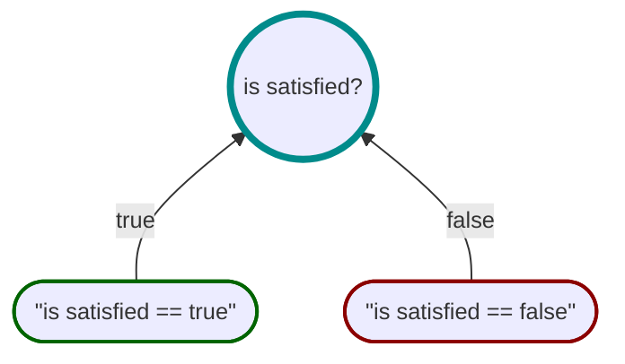

# Minimal proposition



```mermaid
%%{init: { 'themeVariables': { 'fontSize': '13px' }}}%%
flowchart BT
    True(["&quot;is satisfied == true&quot;"]) -->|true| P((is satisfied?))
    False(["&quot;is satisfied == false&quot;"]) -->|false| P

    style P stroke:darkcyan,stroke-width:4px
    style True stroke:darkgreen,stroke-width:2px
    style False stroke:darkred,stroke-width:2px
```

The most concise proposition can be created by providing only a predicate and a propositional statement.
It uses the minimum set of fluent builder methods to create a proposition.


```csharp
var isEven =
    Spec.Build((int n) => n % 2 == 0)    // predicate
        .Create("is even");              // propositional-statement/name

var result = isEven.Evaluate(2);

result.Reason;    // "is even == true"
result.Assertion; // ["is even == true"]
```

And when not satisfied:

```csharp
var result = isEven.Evaluate(3);

result.Reason;    // "is even == false"
result.Assertion; // ["is even == false"]
```

Because no explicit `WhenTrue()` or `WhenFalse()` assertions are provided, Motiv derives them from the propositional
statement supplied to the `Create()` method.
It appends `== true` when the proposition is satisfied and `== false` when it is not, which disambiguates the outcome
when the name is the only text available.

So using the example:

```csharp
Spec.Build((int n) => n % 2 == 0)
    .Create("is even");
```

yields the assertion `is even == true` when satisfied and `is even == false` when not.
