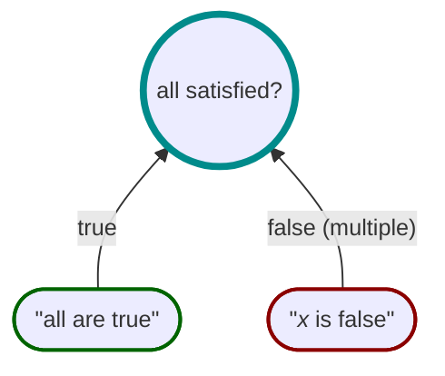

# Multiple Assertions and Metadata




Sometimes you will want to yield multiple assertion statements or metadata objects.
This is done using the`WhenTrueYield()` and the `WhenFalseYield()` methods.
These methods take a factory function that returns an `IEnumerable<string>` or `IEnumerable<TMetadata>` if custom
metadata is used.

For example, consider the following proposition.
We want to ensure that in the event of the proposition being unsatisfied,
we want to yield detailed feedback about each of the underlying models that do not satisfy the proposition.

```csharp
var allEven =
    Spec.Build((int n) => n % 2 == 0))
        .AsAllSatisfied()
        .WhenTrue("all are even")
        .WhenFalseYield(eval => eval.FalseModels.Select(n => $"{n} is odd"))
        .Create();

var results = allEven.Evaluate(1, 2, 3, 4, 5);

result.Assertions; // ["1 is odd", "3 is odd", "5 is odd"]
```
