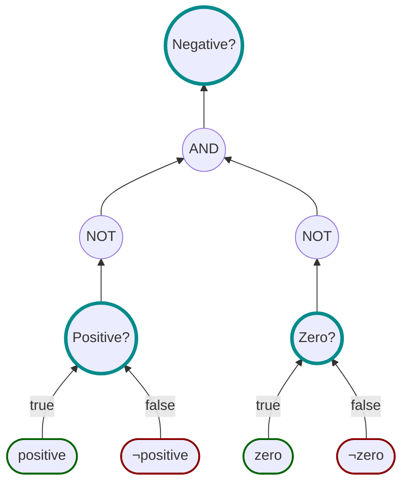

# Operations

Propositions can be logically operated on using either the methods available on the <xref:Motiv.SpecBase`2> base
class, or by using the overloaded logical operators `&`, `|`, `^`, `!`



```csharp
var isPositive = Spec.Build((int n) => n > 0).Create("positive");
var isZero = Spec.Build((int n) => n == 0).Create("zero");

var isNegative = !isPositive & !isZero;
```

Boolean results can also be operated upon in the same way

```csharp
var isPositiveResult = isPositive.IsSatisfiedBy(5);
var isZeroResult = isZero.IsSatisfiedBy(5);

var isNegativeResult = !isPositiveResult & !isZero
```

### Short Circuiting

The AND and the OR operators have [short-circuited](https://en.wikipedia.org/wiki/Short-circuit_evaluation) variants.
These are normally invoked using the `&&` and the `||` operators, but due to the way in the way these operators work it
is not possible for propositions use them.
For propositions, you will have to use the methods `AndAlso()` and `OrElse()` instead.
However, this limitation does not apply to <xref:Motiv.BooleanResultBase> types (or derivatives) so they can use the
`&&` and `||` operators to short-circuit evaluations.
